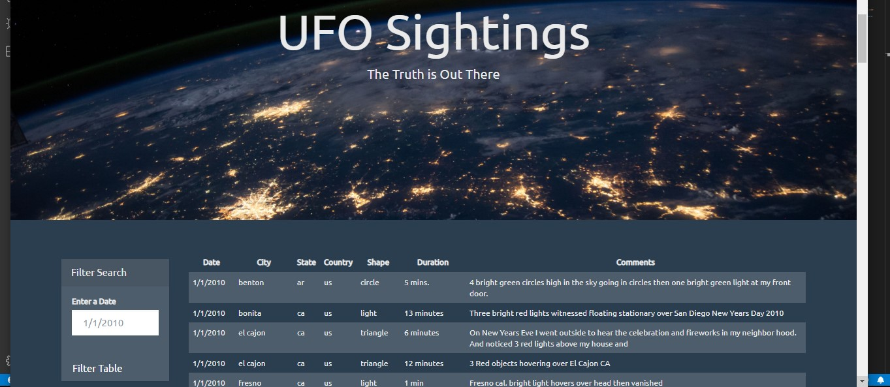

# Ufo-sightings-with-Javascript

This project writes code that will create a table dynamically based upon a dataset, allows the users to filter the table data for specific values, only using pure JavaScript, HTML, and CSS, and D3.js.
Automatic Table and Date Search

•	Create a basic HTML web page 

•	Using the UFO dataset provided in the form of an array of JavaScript objects,  writing code that appends a table to the web page and then adds new rows of data for each UFO sighting.

•	Each dataset has a column for `date/time`, `city`, `state`, `country`, `shape`, and `comment`

•	Using  a date form in the HTML document and write JavaScript code that will listen for events and search through the `date/time` column to find rows that match user input.

